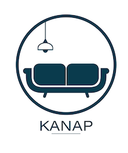

# Kanap #

 

# Identité

- KANAP ! Est une marque de canapés.

- La marque vend uniquement ses produits depuis sa boutique physique exclusivement.

- Aujourd'hui, KANAP souhaiterait avoir une plateforme de e-commerce en plus de sa
boutique physique pour vendre ses produits sur internet.

# Contraintes

- Développement en pur JavaScript
- Aucun framework ( react, angular, Vue ou jQuery par exemple )

# Livrables

* 4 pages déjà mises en place : **Prètes à recevoir le contenu dynamique**
    * Page d'accueil
    * page Produit
    * page Panier
    * page Confirmation

  
  
### Projet ###

This is the front end and back end server for Project 5 of the Web Developer path.

### Back end Prerequisites ###

You will need to have Node and `npm` installed locally on your machine.

### Back end Installation ###

Clone this repo. From the "back" folder of the project, run `npm install`. You
can then run the server with `node server`.
The server should run on `localhost` with default port `3000`. If the
server runs on another port for any reason, this is printed to the
console when the server starts, e.g. `Listening on port 3001`.

